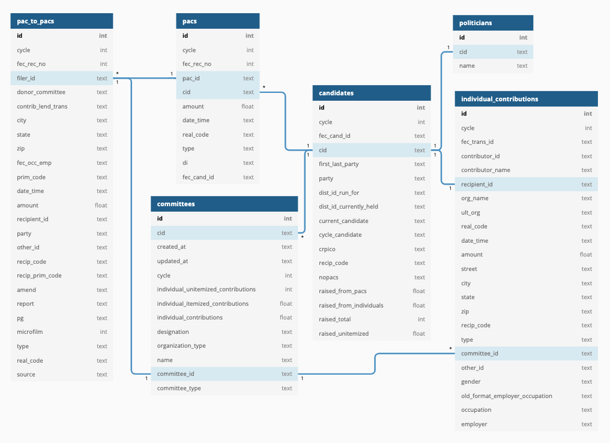

# Campaign Finance Capstone Project

My goal is to predict the amount of money that needs to be raised to win a congressional or senate race in the next election cycle based on location, incumbency status, and a comprehensive history of all individual and PAC contributions since 1990.

### Methods:

Data will be stored in an AWS Relational Database system using PostgreSQL:

  

### Project outline:

After extensive analysis, I plan to use several linear regression models to predict the total amount of money to be raised. The final data product will be a Streamlit app where the user inputs:

- The type of race (Congressional/Senate)
- State
- District (if congressional)
- Political Party
- Incumbency

And the app will generate a prediction of:
- A sliding scale of total amount of money to be raised
    - shows percent chance of winning based on dollar amount
- Recommendations for
    - 10 Top individual donors for fundraising
    - 5 Top coporate PAC sponsors
    
### Source:
This dataset was downloaded from a Kaggle board: https://www.kaggle.com/jeegarmaru/campaign-contributions-19902016. However, the original data was scraped from https://www.opensecrets.org/open-data/bulk-data-documentation.